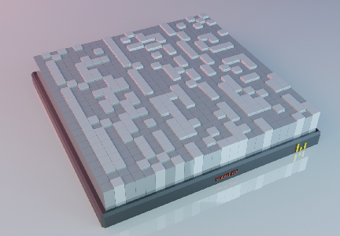

# CryptoBars-Hamlet: Collectible Hamlet pieces in binary on the Ethereum Blockchain

CryptoBars-Hamlet are 2652 unique collectible pieces of Shakespeare's Hamlet in binary (0 and 1). Each piece contains 72 charachter from the tragedy (576 bits) Pieces of each Scene has a unique color (there are 20 Scenes). Every single piece can be officially owned by a single person as managed and verified by a contract running on the Ethereum blockchain.

## How it works
Here is the first piece, containing the following text in binary:

```
THE TRAGEDY OF HAMLET, PRINCE OF DENMARK\n
\n
by William Shakespeare\n
\n
\n
SCENE\n
```



The first row of the piece contains:
T:'01010100'
H:'01001000'
E:'01000101'
